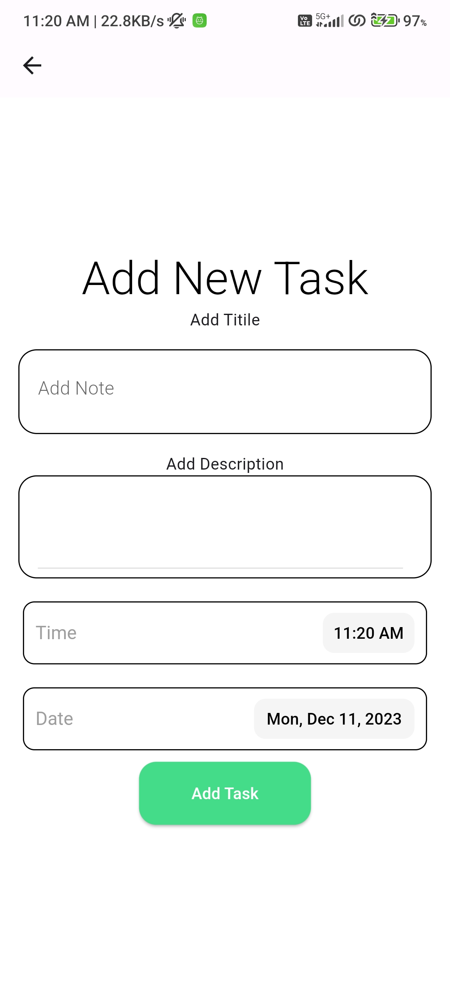

# Task App

Task App is a Flutter application for managing tasks. It allows users to create, update, and delete tasks, and provides a simple and intuitive interface for task management.

## Features

- **Task Management:** Add, update, and delete tasks.
- **Date and Time Selection:** Set due dates and times for tasks.
- **Task Completion Tracking:** Visualize completed tasks with a progress indicator.
- **User-Friendly Interface:** Clean and easy-to-use design.

## Usage

1. Launch the app.
2. Add a new task by tapping on the '+' button.
3. Fill in the task details such as title, description, date, and time.
4. Save the task.
5. View and manage your tasks on the home screen.
6. Swipe to delete a task or tap on it to update.
7. Use the floating action button to add new tasks.

## App Screen ScreenShots

